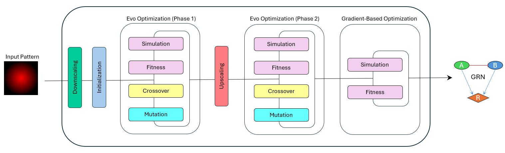

# Automated Design and Analysis of Gene Regulatory Networks (GRNs)



**GRN Designer** is a computational framework for constructing and optimizing gene regulatory networks (GRNs) to simulate complex 2D spatial patterns. It combines evolutionary algorithms and gradient-based optimization to design GRNs by tuning genes, their initial conditions, and interaction parameters.

---

## Key Features

1. **Dual Optimization**:
   - Uses genetic algorithms for global search.
   - Combines with gradient-based methods for fine-tuning locally.

2. **Custom Initial Conditions**:
   - Allows defining spatially varied gene expression levels.

3. **Scalable Complexity**:
   - Simulates various patterns and GRN architectures by adjusting model parameters.

---


## Requirements

To install the required dependencies for the project, you can use the `requirements.txt` file. 


Install these libraries using `pip`:
```bash
pip install -r requirements.txt
```

---

## How to Use the Code

1. **Prepare the Code**:
   - Download all `.py` files from the `src` directory and place them in the same folder as your script. For a full guideline on how to use the GRN-Designer: [guide.ipynb](src/guide.ipynb)
 ```python
     from grn_designer import GRNDesigner as grnd
     model = grnd(
         target="targen-diffusion-pattern" # a 2d matrix,
         agent="agent" # a 3d matrix as an example agent used for initialization. see 'grn_designer.py' to find out more about it.
         ... # the hyperparameters of the model are set by default but should be adjust based on the model. see 'grn_designer.py' to find out more about them. 
     ) 
     results = model.fit() # run the process
```

     
     
     
## Citation

```bibtex
@MastersThesis{loghman-samani-2024-stuttgart,
    author    = {Samani, Loghman},
    title     = {Automated Design and Analysis of Gene Regulatory Networks for Simulating Complex Spatial Patterns},
    school    = {University of Stuttgart},
    year      = {2024},
    type      = {Master's Thesis},
}
```
